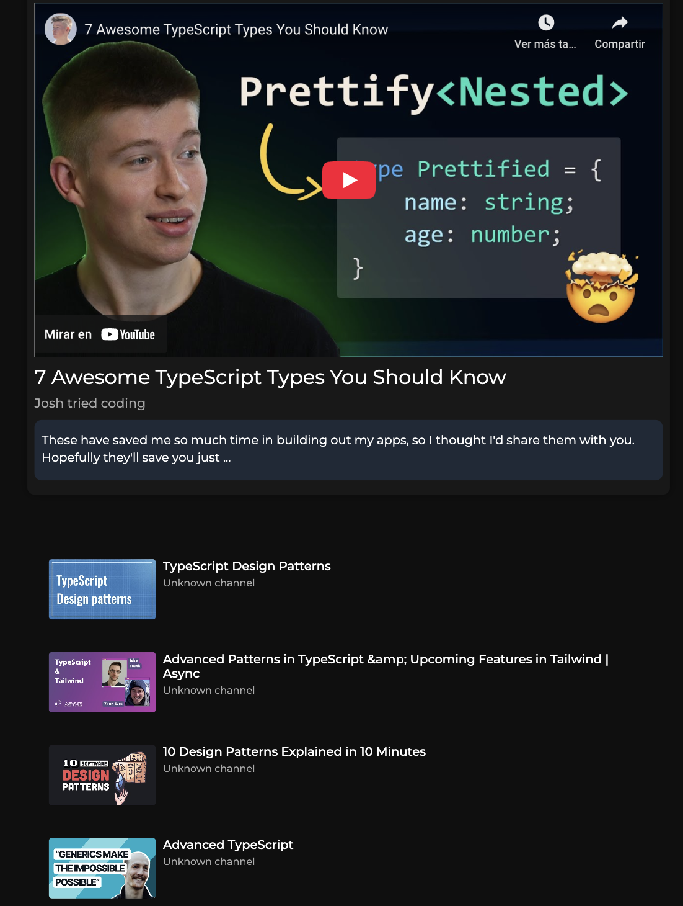
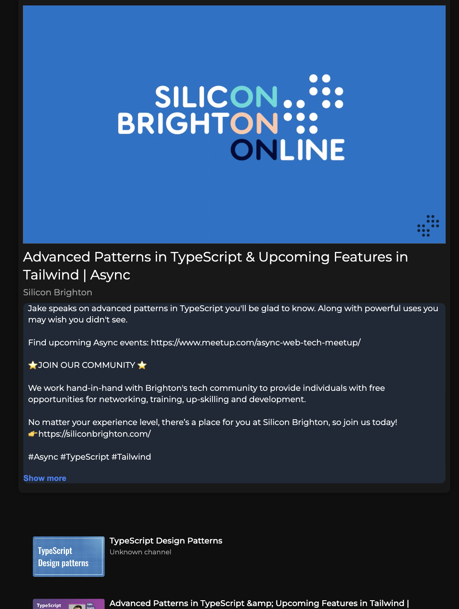
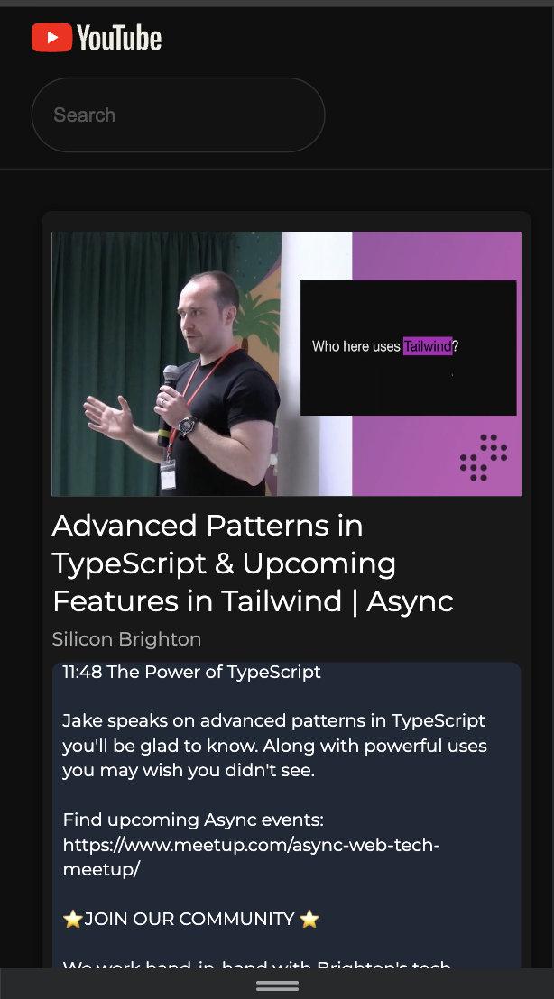

# 🎥 Personal YouTube Web Player

A clean and minimal **React 17** application that allows users to search, browse, and watch YouTube videos using the YouTube Data API. Deployed on GitHub Pages and styled with SCSS and Framer Motion for subtle animations.

##  Live Demo

👉 [View it live](http://isabella-417.github.io/youtube-web-player)

##  Preview
Below are some interface previews from the app:

  
  
  

## 🔍 Features

- 🔎 Search YouTube videos by entering a query and pressing **Enter**.
- 🎞️ Display up to 5 video results as thumbnails in a sidebar.
- ▶️ Click a video to play it in the main video player.
- 📄 View the video title and description under the player.
- 🎨 Responsive layout with clean, animated transitions.

## 🚀 Tech Stack

| Tech              | Purpose                                     |
|-------------------|---------------------------------------------|
| **React 17**       | UI framework                               |
| **React Scripts**  | Build & development tooling                |
| **Sass (SCSS)**    | Modular styling                            |
| **Framer Motion**  | Smooth animations                          |
| **Axios**          | API requests                               |
| **YouTube Data API v3** | Fetch videos                          |
| **gh-pages**       | GitHub Pages deployment                    |
| **Jest + React Testing Library** | Unit and UI testing         |

## 🔧 Setup & Run Locally

### 1. Clone the Repo

\`\`\`bash
git clone https://github.com/Isabella-417/youtube-web-player.git
cd youtube-web-player
\`\`\`

### 2. Install Dependencies

\`\`\`bash
npm install
\`\`\`

### 3. Set Up Environment Variables

Create a `.env` file in the root with:

\`\`\`env
REACT_APP_API_KEY=your_youtube_api_key
REACT_APP_URL_BASE=https://www.googleapis.com/youtube/v3
\`\`\`

> 🔑 You can obtain an API key from the [Google Cloud Console](https://console.cloud.google.com/).

### 4. Start the App

\`\`\`bash
npm start
\`\`\`

Visit `http://localhost:3000` to view the app in your browser.

## 🚢 Deployment

This app is deployed on **GitHub Pages** using the \`gh-pages\` package.

To build and deploy:

\`\`\`bash
npm run predeploy
npm run deploy
\`\`\`

> Ensure \`homepage\` is set correctly in \`package.json\`.

## 🧪 Run Tests

\`\`\`bash
npm test
\`\`\`

## 📝 License

This project is open-source and for learning purposes.
